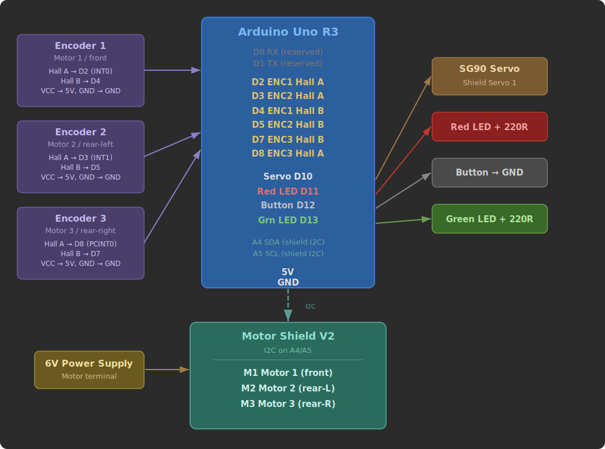
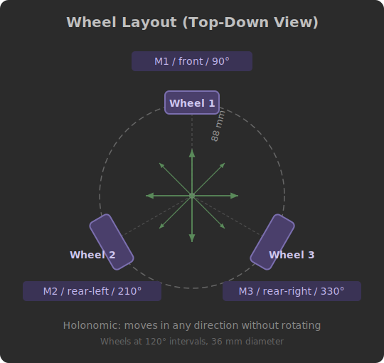

# Omni-Wheel Drawing Robot

An Arduino-based three-wheeled holonomic robot that draws pre-programmed patterns on paper. Built for Engineering 1 coursework.

The robot uses three omni-wheels arranged 120 degrees apart, allowing it to slide in any direction without turning. A servo-actuated pen mechanism lifts and lowers to create drawings from coordinate data stored in flash memory.

---

## Table of Contents

- [Features](#features)
- [Hardware Overview](#hardware-overview)
- [Bill of Materials](#bill-of-materials)
- [Wiring Schematic](#wiring-schematic)
- [Wheel Layout](#wheel-layout)
- [Assembly](#assembly)
- [Software Setup](#software-setup)
- [Usage](#usage)
- [License](#license)

---

## Features

- **Holonomic drive** — moves in any direction without rotating, using 3 omni-wheels at 120-degree intervals
- **PID position control** — closed-loop feedback at 100 Hz for accurate movement (within 0.8 mm)
- **Magnetic encoder feedback** — quadrature Hall-effect encoders on each motor (600 ticks/revolution)
- **Pen lift servo** — SG90 micro servo raises and lowers a pen for drawing
- **PROGMEM drawing storage** — coordinate paths stored in flash memory to conserve SRAM
- **Button start** — press to draw

---

## Hardware Overview

| Component | Specification |
|-----------|---------------|
| Microcontroller | Arduino Uno R3 (ATmega328P, 16 MHz) |
| Motor Driver | Adafruit Motor Shield V2 (I2C) |
| Motors | 3x Adafruit N20 DC Motors, 6V, 1:50 gear ratio |
| Encoders | Magnetic, 12 PPR (600 ticks/rev after gearing) |
| Pen Servo | SG90 Micro Servo |
| Wheels | 36 mm diameter omni-wheels |
| Robot Radius | 88 mm (center to wheel contact) |

---

## Bill of Materials

| Qty | Part | Notes |
|-----|------|-------|
| 1 | Arduino Uno R3 | Main controller |
| 1 | Adafruit Motor Shield V2 | Stacks on top of the Uno |
| 3 | N20 DC motor with magnetic encoder | 6V, 1:50 gear ratio, 6-wire |
| 3 | 36 mm omni-wheels | Press-fit onto motor shafts |
| 1 | SG90 micro servo | For pen lift mechanism |
| 1 | Momentary pushbutton | Normally open |
| — | Jumper wires, mounting hardware | As needed |

---

## Wiring Schematic

### Pin Reference Table

| Arduino Pin | Function | Connects To | Notes |
|-------------|----------|-------------|-------|
| D2 | Encoder 1 Hall A | Motor 1 encoder (front) | Hardware interrupt INT0, rising edge |
| D3 | Encoder 2 Hall A | Motor 2 encoder (rear-left) | Hardware interrupt INT1, rising edge |
| D4 | Encoder 1 Hall B | Motor 1 encoder (front) | Digital read for direction |
| D5 | Encoder 2 Hall B | Motor 2 encoder (rear-left) | Digital read for direction |
| D7 | Encoder 3 Hall B | Motor 3 encoder (rear-right) | Digital read for direction |
| D8 | Encoder 3 Hall A | Motor 3 encoder (rear-right) | Pin-change interrupt PCINT0 |
| D10 | Servo PWM | SG90 pen servo | Via Motor Shield Servo 1 header |
| D12 | Start button | Pushbutton → GND | INPUT_PULLUP, active LOW |
| A4 (SDA) | I2C data | Motor Shield V2 | Shared I2C bus |
| A5 (SCL) | I2C clock | Motor Shield V2 | Shared I2C bus |

### Motor Shield Connections

| Terminal | Motor | Position |
|----------|-------|----------|
| M1 | N20 DC motor + encoder | Front (90°) |
| M2 | N20 DC motor + encoder | Rear-left (210°) |
| M3 | N20 DC motor + encoder | Rear-right (330°) |
| VIN / GND | 6V power supply | Motor power input |

### Encoder Wiring (each motor, 6 wires)

| Wire | Color (typical) | Connects To |
|------|----------------|-------------|
| Motor + | Red | Motor Shield M terminal |
| Motor - | Black | Motor Shield M terminal |
| Encoder VCC | — | Arduino 5V rail |
| Encoder GND | — | Arduino GND rail |
| Hall Sensor A | — | See pin table (interrupt pin) |
| Hall Sensor B | — | See pin table (direction pin) |

---

## Wheel Layout

Three omni-wheels at 120-degree intervals allow the robot to translate in any direction without rotating.

---

## Assembly

> **CAD files and detailed assembly instructions will be added soon.**

General steps:

1. Mount the three N20 motors in the chassis at 120-degree intervals
2. Press omni-wheels onto the motor shafts
3. Stack the Adafruit Motor Shield onto the Arduino Uno
4. Connect motor power wires to M1, M2, M3 terminals on the shield
5. Wire encoder signals to the Arduino pins as shown above
6. Mount the SG90 servo for the pen lift mechanism
7. Connect the servo to the "Servo 1" header on the Motor Shield
8. Wire the button on a small breadboard or perfboard

---

## Software Setup

### Requirements

- [Arduino IDE](https://www.arduino.cc/en/software) (1.8+ or 2.x)
- Libraries (install via Library Manager):
  - `Adafruit Motor Shield V2 Library`
  - `Servo` (built-in)
  - `Wire` (built-in)

### Upload

1. Open `Code/omni_draw_robot.ino` in the Arduino IDE
2. Select **Board: Arduino Uno** and the correct **Port**
3. Click **Upload**
4. Open the Serial Monitor at **115200 baud** to see status messages

See [`Code/README.md`](Code/README.md) for detailed firmware documentation, function-by-function breakdown, and how to create custom drawings.

---

## Usage

1. Power on the Arduino
2. Place the robot on a flat surface with paper underneath
3. Insert a pen or marker into the pen holder
4. **Press the button** to start drawing
5. When finished, the robot returns to its starting position

### Default Drawing

The robot draws **"HELLO"** in block letters (~276 mm wide x 90 mm tall, fits within a 300 x 300 mm area). Custom drawings can be created by modifying `Code/hello_drawing.h`.

---

## License

This project was built for educational purposes as part of an Engineering 1 course.
